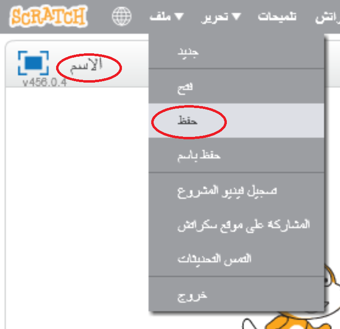

+ سمِّ برنامجك بكتابة اسم له في مربع النص في الزاوية العلوية اليسرى.

+ يمكنك النقر فوق **ملف** ثم **حفظ الآن** لحفظ مشروعك.

	

+ __ملاحظة:__ إذا كنتَ تستخدم Scratch عبر الإنترنت ولم يكن لديك حساب عليه، فيمكنك أن تحفظ نسخة من مشروعك بالنقر فوق **تنزيل إلى جهازي** بدلًا من ذلك.

