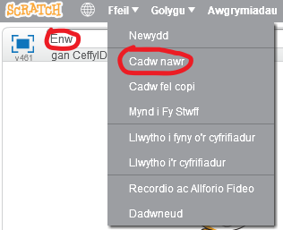

+ Rhowch enw ar eich rhaglen gan deipio yn y blwch testun yn y gornel chwith uchaf.

+ Gallwch glicio **Ffeil** ac yna **Cadw nawr** i gadw eich prosiect.
    
    

+ **Nodyn:** os ydych yn defnyddio Scratch ar-lein ond nid oes gennych gyfrif Scratch, gallwch gadw copi o'ch prosiect gan glicio **Llwytho i'r cyfrifiadur** yn lle hynny.