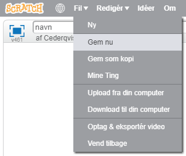

+ Giv dit program et navn ved at skrive det ind i tekstboksen øverst til venstre.

+ Du kan klikke på **Fil** og derefter **Gem nu** for at gemme dit projekt.
    
    

+ **Bemærk:** Hvis du bruger Scratch online, men ikke har en Scratch-konto, kan du gemme en kopi af dit projekt ved at klikke på **Download til din computer** i stedet for.