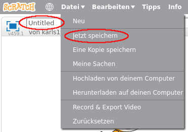

+ Gib deinem Programm einen Namen, indem du ihn in das Textfeld in der oberen linken Ecke eingibst.

+ Um dein Projekt zu speichern, klickst du auf **Datei** und dann auf **Projekt speichern**.
    
    

+ **Hinweis:** Wenn du scratch online verwendest, aber kein Konto hast, kannst du eine Kopie deines Projekts speichern indem du auf **Herunterladen auf deinen Computer** klickst.