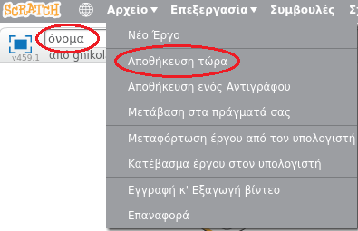

+ Δώσε στο πρόγραμμα σου ένα όνομα πληκτρολογώντας στο πλαίσιο κειμένου στην επάνω αριστερή γωνία.

+ Μπορείς να κάνεις κλικ στο **Αρχείο** και, στη συνέχεια, **Αποθήκευση τώρα** για να αποθηκεύσεις το έργο σου.
    
    

+ **Σημείωση:** αν χρησιμοποιείς το Scratch online αλλά δεν έχεις λογαριασμό Scratch, μπορείς να αποθηκεύσεις ένα αντίγραφο του έργου σου κάνοντας κλικ στο **Κατέβασμα έργου στον υπολογιστή**.