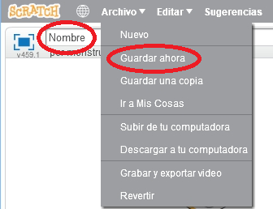

+ Dale un nombre a tu programa escribiéndolo en el cuadro de texto en la esquina superior izquierda.

+ Para guardar tu proyecto, puedes hacer clic en **Archivo** y luego en **Guardar ahora**.
    
    

+ **Nota:** Si usas la versión en linea de Scratch pero no tienes una cuenta, puedes guardar una copia de tu proyecto haciendo clic en **Descargar a tu computadora**.