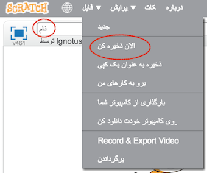

+ نام برنامه خود را با تایپ کردن در جعبه متن در گوشه بالا سمت چپ به نام برنامه خود قرار دهید.

+ شما می توانید روی **فایل** و سپس **را کلیک کنید و اکنون** را ذخیره کنید تا پروژه خود را ذخیره کنید.
    
    

+ **توجه:** اگر شما از Scratch آنلاین استفاده می کنید ولی یک حساب کاربری Scratch ندارید، می توانید یک کپی از پروژه خود را با کلیک روی **به جای** کامپیوتر خودتان ذخیره کنید.