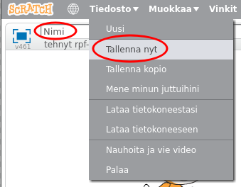

+ Anna ohjelmalle nimi kirjoittamalla tekstikenttään vasemmassa yläkulmassa.

+ Voit napsauttaa **Tiedosto** ja tallentaa projektisi **Tallenna nyt**.
    
    

+ **Huomaa:** Jos käytät Scratchia verkossa, mutta sinulla ei ole Scratch-tiliä, voit tallentaa projektisi kopion klikkaamalla **Lataa tietokoneeseen**.