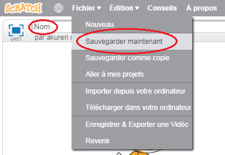

+ Donne un nom à ton programme en tapant dans la zone de texte dans le coin supérieur gauche.

+ Tu peux cliquer sur **Fichier** puis **Sauvegarder maintenant** pour enregistrer ton projet.
    
    

+ **Note:** Si tu utilise Scratch en ligne mais que tu n'as pas de compte Scratch, tu peux sauvegarder une copie de ton projet en cliquant sur **Télécharger dans votre ordinateur**.