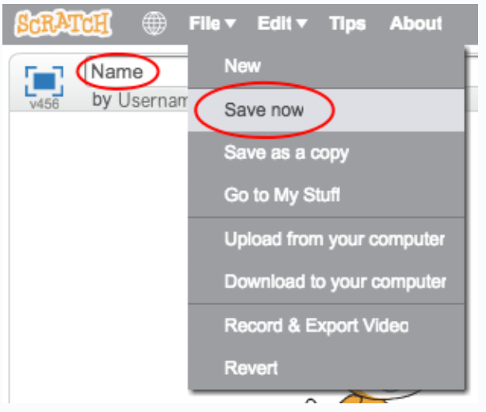

+ शीर्ष बाएँ कोने में टेक्स्ट बॉक्स में टाइप करके अपने प्रोग्राम को नाम दें।

+ आप अपने प्रोजेक्ट को सहेजने के लिए **File** और फिर **Save now** पर क्लिक कर सकते हैं।

	

+ __ध्यान दें:__ यदि आप Scratch ऑनलाइन उपयोग कर रहे हैं, परन्तु आपके पास Scratch खाता नहीं है, तो आप **Download to your computer** पर क्लिक करके अपने प्रोजेक्ट की प्रतिलिपि को सहेज सकते हैं।

