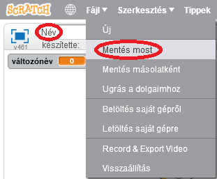

+ Adja meg a program nevét a bal felső sarokban található szövegdobozba írva.

+ A projekt mentéséhez kattintson a **fájl** , majd a **Mentés** gombra.
    
    

+ **Megjegyzés:** ha Scratch-ot használ az interneten, de nincs Scratch-fiókja, akkor mentheti a projekt egy példányát ahelyett, hogy a **letöltés a számítógépre** elemre kattint.