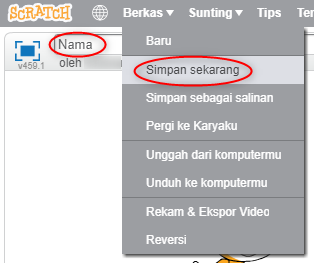

+ Berikan nama program Kamu dengan mengetik pada kotak teks di pojok kiri atas.

+ Kamu bisa klik **Berkas** dan kemudian **Simpan Sekarang** untuk menyimpan proyek Kamu.
    
    

+ **Catatan:** jika Kamu menggunakan Scratch secara daring namun tidak memiliki akun Scratch, Kamu dapat menyimpan salinan proyek Kamu dengan mengklik **Unduh ke komputermu**.