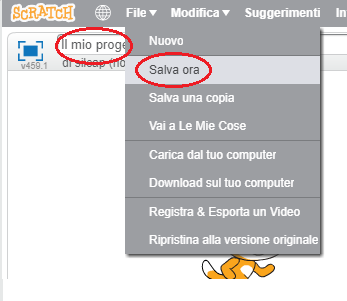

+ Dai un nome al tuo programma scrivendolo nella casella di testo che si trova nell’angolo in alto a sinistra.

+ Per salvare il progetto, seleziona la voce **Salva ora** dal menu **File**.
    
    

+ **Nota:** se stai usando Scratch online ma non hai un account Scratch, puoi comunque salvare una copia del tuo progetto selezionando **Download sul tuo computer**.