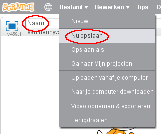

+ Geef je programma een naam door deze in het tekstvak in de linkerbovenhoek te typen.

+ Je kunt klikken op **Bestand** en vervolgens **Nu opslaan** om je project te bewaren.
    
    

+ **Opmerking:** als je Scratch online gebruikt maar geen Scratch-account hebt, kunt je een kopie van je project opslaan door te klikken op **Naar je computer downloaden**.