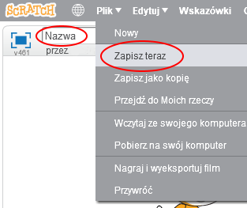

+ Nadaj programowi nazwę, wpisując tekst w polu tekstowym w lewym górnym rogu.

+ Możesz kliknąć **Plik**, a następnie **Zapisz teraz**, aby zapisać swój projekt.
    
    

+ **Uwaga:** jeżeli korzystasz ze Scratcha w wersji online, ale nie masz konta w Scratchu, możesz zapisać kopię projektu klikając **Pobierz na swój komputer**.