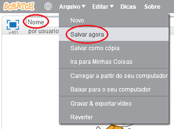

+ Dê ao seu programa um nome digitando na caixa de texto no canto superior esquerdo.

+ Você pode clicar em **Arquivo** e depois em **Salvar agora** para salvar seu projeto.
    
    

+ **Nota:** Se você estiver usando o Scratch online, mas não possui uma conta Scratch, você pode salvar uma cópia do seu projeto clicando em **Baixar para o seu computador**.