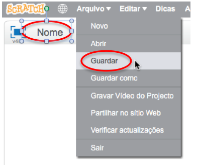

+ Dá ao teu programa um nome digitando na caixa de texto no canto superior esquerdo.

+ Podes clicar em **Arquivo** e depois em **Guardar** para guardares o teu projeto.
    
    

+ **Nota:** Se estiveres a usar Scratch online, mas não tens uma conta Scratch, podes guardar uma cópia do teu projeto clicando em **Faça Download para o seu computador**.