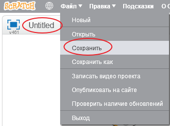

+ Назови свой проект, введя его в текстовое поле в верхнем левом углу (в версии онлайн-редактора). В версии для компьютера просто нажми на кнопку "Сохранить", а название проекта сможешь ввести после появления окна для сохранения.

+ В версии редактора на сайте ты можешь нажать на меню **Файл**, а затем **Сохранить сейчас** и проект сохранится.
    
    

+ **Примечание:** если ты используешь онлайн-редактор Scratch (который на сайте), но у тебя нет учетной записи Скретч, то ты можешь сохранить копию своего проекта, щелкнув по пункту меню **Скачать на свой компьютер**.