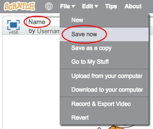

+ Programu dajte ime tako, da v zgornjem levem kotu vnesete besedilno polje.

+ Če želite shraniti projekt, lahko kliknete **datoteko** in nato **Shrani zdaj**.
    
    

+ **Opomba:** , če uporabljate spletno mesto Scratch, a nimate računa Scratch, lahko kopirate svoj projekt s klikom na **Prenesi v računalnik**.