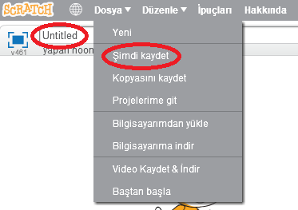

+ Sol üst köşedeki metin kutusuna yazarak programınıza bir isim verin.

+ Projenizi kaydetmek için **Dosya** kısmından **Şimdi kaydet** seçeneğini tıklayabilirsiniz.
    
    

+ **Not:** Scratch'i çevrimiçi kullanıyorsanız, ancak bir Scratch hesabınız yoksa, bunun yerine **Bilgisayarıma indir**'e tıklayarak projenizin bir kopyasını kaydedebilirsiniz.